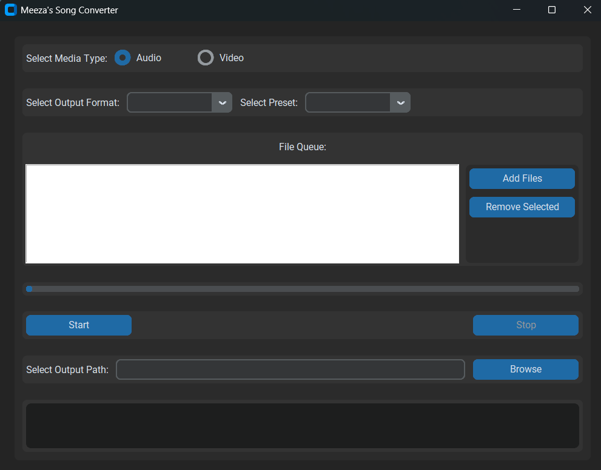

# Meeza's Better Video/Audio Converter 🎵🎬

## Screenshot



## Overview

Meeza's Song Converter is a user-friendly desktop application built with Python that allows you to easily convert audio and video files between various formats. Whether you need to change file formats, compress media, or optimize for different quality levels, this tool has got you covered!


## Features

- 🎧 Audio Conversion
  - Supported Input Formats: MP4, MKV, AVI, MP3, WAV, OGG, WEBM, FLV, MOV
  - Output Formats: MP3, WAV, OGG, AAC, FLAC
  - Quality Presets: High, Medium, Low, Fastest

- 🎥 Video Conversion
  - Supported Input Formats: MP4, MKV, AVI, MP3, WAV, OGG, WEBM, FLV, MOV
  - Output Formats: MP4, WEBM, AVI, FLV, MOV, MKV
  - Quality Presets: High, Medium, Low, Fastest

- 🚀 Key Capabilities
  - Multi-file queue support
  - Pause and resume conversion
  - Progress tracking
  - Customizable output path
  - Real-time conversion logs

## Prerequisites

- Python 3.7+
- FFmpeg installed on your system
- Required Python libraries:
  - customtkinter
  - tkinter

## Installation

1. Clone the repository:
   ```bash
   git clone https://github.com/Chungus1310/Meeza-s-Better-Video-Audio-Converter.git
   cd Meeza-s-Better-Video-Audio-Converter
   ```

2. Install required dependencies:
   ```bash
   pip install customtkinter ffmpeg-python
   ```

3. Ensure FFmpeg is installed on your system:
   - Windows: Download from [FFmpeg Official Site](https://ffmpeg.org/download.html)
   - macOS: `brew install ffmpeg`
   - Linux: `sudo apt-get install ffmpeg`

## Usage

1. Run the application:
   ```bash
   python converter.py
   ```

2. Select Media Type:
   - Choose between Audio and Video conversion

3. Select Output Format and Preset:
   - Pick your desired format and quality level

4. Add Files:
   - Click "Add Files" to select media files for conversion
   - Multiple files can be queued

5. Choose Output Path:
   - Click "Browse" to select where converted files will be saved

6. Start Conversion:
   - Click "Start" to begin converting files
   - Use "Stop" to interrupt the process if needed

## Conversion Presets

### Audio Presets
- **High Quality**: 192kbps
- **Medium Quality**: 128kbps
- **Low Quality**: 96kbps
- **Fastest**: Ultra-compressed conversion

### Video Presets
- **High Quality**: CRF 20
- **Medium Quality**: CRF 23
- **Low Quality**: CRF 26
- **Fastest**: Ultrafast encoding

## Troubleshooting

- Ensure FFmpeg is correctly installed and accessible in system PATH
- Check that input files are not corrupted
- Verify sufficient disk space for conversion

## Contributing

Contributions are welcome! Please feel free to submit a Pull Request.

## License

This project is open-source. See the LICENSE file for details.

## Credits

Built by Chun 👨‍💻

## Disclaimer

This tool uses FFmpeg for conversions. Always ensure you have the rights to convert and use the media files.
